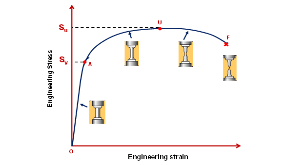
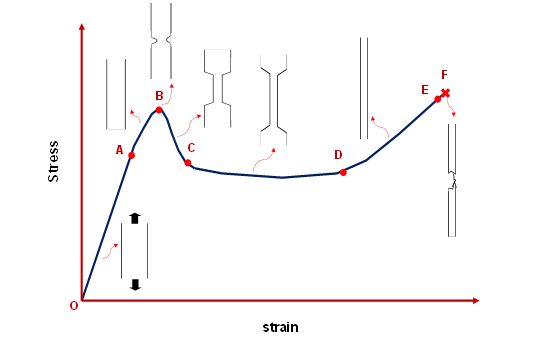
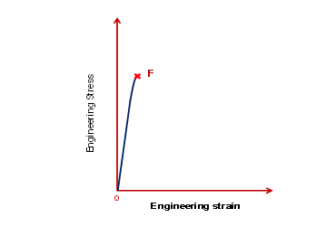

The tensile stress-strain curve nature for different materials (i.e., metals, polymers and ceramics) are different  
<b>(a) Stress-strain curve of polycrystalline metals:</b> Typical engineering stress-strain curve for a polycrystalline metal (for example aluminium) is shown in Fig. 1. The common definitions of yield strength (Sy) and ultimate tensile strength (Su) of ductile metals are illustrated in Fig. 1. OA is the elastic regime. Yield strength is defined as the stress value corresponding to a strain value of 0.002 (draw parallel line to OA from a strain value of 0.002 and the intersection point is A – corresponding to Sy). Point at maximum load (U), at which an unstable neck initiates, gives the ultimate tensile strength (or tensile strength) Su. After necking, the deformation is concentrated in the necked region due to small cross-sectional area, i.e., deformation is non-uniform in the gauge section. Finally, the sample fractures at F.   
  
<i>Fig. 1: Engineering stress-strain curve for a polycrystalline metal</i>  
(b) Stress-strain curve of thermoplastic polymers: Polymeric solids show a whole range of stress-strain responses, depending on conditions, from very creepy behavior to stiff elastic behavior, a rubbery range in between. 
Fig. 2 shows a typical stress-strain curve for a thermoplastic polymer. ‘OA’ is the elastic regime, where Hooke’s law is valid. There is a departure from linearity at point A and the load curve rises to a local maximum at B, at which point the neck initiates. The yield stress of the thermoplastic polymer is poorly defined since the stress-strain curves bends over at the top of the elastic region (see Fig. 2 after point A). Generally, the value at the top of the curve (point B) is used as ‘yield point’. The load then falls as the neck is reduced in cross-sectional area, until stability is reached (point C), and the neck propagates along the test piece at essentially constant stress (till point D). The process in the region ‘CD’ is also called “cold drawing”. Subsequently, after neck has propagated along the length of the test bar, the stress increases again due to strain hardening, till fracture occurs at point F.   
  
<i>Fig. 2: Stress-strain curve for a thermoplastic polymer</i> 
(a) Stress-strain curve of ceramics: Typical stress-strain curve for a ceramic material is shown in Fig. 3. The curve is linear (elastic regime) till fracture. Ceramics typically exhibits no or very limited plasticity and typically do not show necking. The area under the stress-strain curve is small, and therefore monolithic ceramic materials exhibit low toughness as compared to metals.  
 
<i>Fig. 3: Stress-strain curve for a ceramic material.</i> 

